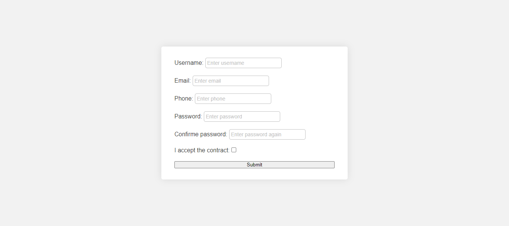

# Formulário 
Treinamento lógica de programação e Javascript na escola de habilidades digitais Digital College. Criação de formulário com validação.
Foi utilizado a plataforma [codeInStages](https://codeinstages.com/instructions).

## Visão Geral

### Screenshot

### Links

- Solution URL: [https://github.com/Leandro-Frota/formJsValidation]
- Live Site URL: [https://leandro-frota.github.io/formJsValidation/]

### Temas
- HTML5
- CSS 
- JAVASCRIPT

### Autor
- Leandro Frota
